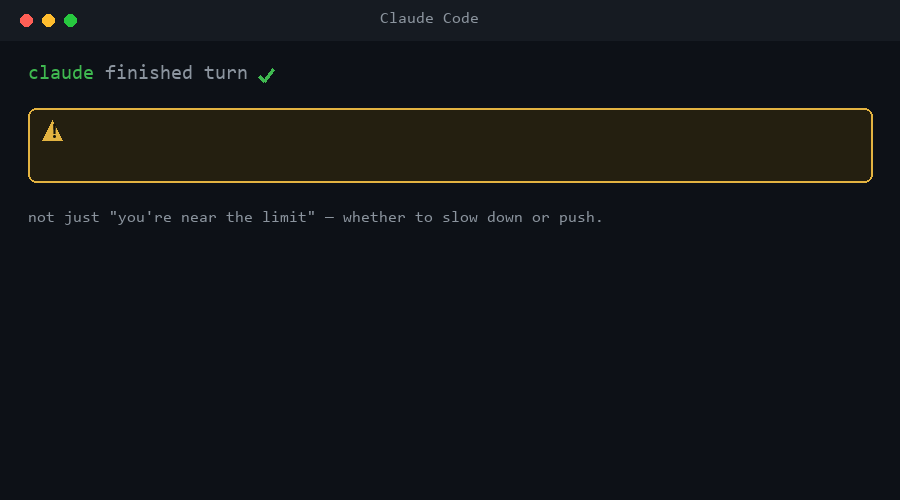

# usage-guard

    

Claude Code will cut you off mid-task when you hit your 5-hour or weekly limit. **usage-guard warns you *before* that happens, right in the session.**

A tiny [Claude Code](https://code.claude.com) plugin that **warns you in-session as you approach your real plan limits** and tells you when a fresh 5-hour or weekly window is ready. It includes concrete numbers, an **even-pace readout** (should you slow down or push?), a burn-rate proxy, and a `/usage-guard:usage` command to check anytime.

> **Why it matters:** a fresh quota window is easy to burn in one afternoon. Knowing both when it opens and whether your pace is sustainable makes that new allowance useful instead of accidental.



*Top: the `Stop`-hook warning with the even-pace readout (should you slow down or push?). Bottom: `/usage-guard:usage` showing the full breakdown.*

It runs in two quota modes automatically, plus a fresh-window coach:

- **Primary — real plan quota.** If you wire up the tiny status-line shim (one line in your settings, below), Claude Code hands it your actual `rate_limits` (5-hour + weekly `used_percentage` and reset times). usage-guard snapshots that locally and warns when a window crosses your threshold: `⚠️ Plan 5h quota: 88% used · resets in 1h 29m`.
- **Fallback — weighted budget.** If the real quota isn't available (status-line not wired, or a session that hasn't had its first API response yet), it falls back to a budget **you** set against a "weighted spend" proxy read from local transcripts: `🛑 Over budget: 120% (6.0M of 5.0M) in 5h`.
- **Fresh-window coach.** Once real quota is available, a conservative local detector announces each newly observed 5-hour or weekly window once: `🎉 ¡Cuota fresca! Ventana nueva lista (5h) — aprovéchala.`

Either way it's **quiet** (one alert per event, plus a warning cooldown) and **safe** (zero dependencies; reads local files; network is **off by default**; fail-open with a 5s cap). An optional `ntfy` reset alert is the only network path and runs only when you explicitly configure a topic.

> **Doesn't Claude Code already warn me about the 5-hour limit?** Yes — it shows a native heads-up near the limit. The difference: the native nudge tells you you're **near the cliff**; usage-guard tells you **how to pace the window so you never reach it**. You get an even-pace readout (`68% used · 18% ahead of even pace — slow down to make it last`) for *both* the 5h and weekly windows, exact % + reset countdown, the **weighted burn-rate** fallback when real quota isn't present, and `/usage-guard:usage` on demand. If you only want the native nudge, you don't need this.

> **How is this different from [ccusage](https://github.com/ryoppippi/ccusage)?** ccusage is a great *reporting* CLI you run to see a breakdown. usage-guard is a *proactive guard*: it nudges you **in the moment**, inside the session, as you near a limit. Use both.

> **What about status-line usage monitors (claude-powerline, Claude Code Usage Monitor, …)?** Those display usage passively — you have to look at them. usage-guard actively **interrupts** via the `Stop` hook when a threshold is crossed, so you don't have to remember to check. (Its own status-line shim is just a snapshot mechanism, not a display — it keeps whatever status line you already have.)

## Install

```
/plugin marketplace add eltonylfgi-blip/claude-code-usage-guard
/plugin install usage-guard@cc-guard
```

### Choose your setup path

**DIY — free.** Enable the real 5-hour + weekly quota reading below. Setup is complete when `/usage-guard:usage` starts with:

`Real plan quota`

**Hands-on — 7.20 EUR · 3 pilot spots.** I help you connect the real-quota capture, verify a valid 5-hour + weekly reading on your machine, and calibrate the warning threshold for your plan. **Full refund if we cannot get a valid real-quota reading.**

[Get my real quota working ->](https://eltonylfgi.gumroad.com/l/sqviyh)

The `Stop` hook is active immediately — you get the fallback (weighted-budget) warnings right away. The headline **real plan quota** mode (what's in the GIF) needs one extra one-time step: the status-line wiring below (~30 seconds).

### Did it help? Tell me in 30 seconds

If usage-guard saved a session, behaved unexpectedly, or its real-quota mode did (or didn't) appear, **[send a 30-second field report](https://github.com/eltonylfgi-blip/claude-code-usage-guard/issues/new?template=use-case.yml)**. One sentence is enough; a Claude Code version and whether you enabled the status-line shim help diagnose setup-specific behavior. Real reports decide what gets improved next.

### Enable real plan quota (one-time, ~30 seconds)

Claude Code only exposes your real `rate_limits` to a **status-line** command, never to a hook — so usage-guard ships a small status-line shim that snapshots them to a local file the hook reads. (This is a documented Claude Code limitation, not a workaround: a plugin can't auto-register a top-level `statusLine`, so you add the one line.)

Add a `statusLine` block to `~/.claude/settings.json` (Windows: `%USERPROFILE%\.claude\settings.json`). Use the path to your installed plugin (after install it lives under `~/.claude/plugins/`; the exact dir is shown by `/plugin`):

```json
{
  "statusLine": {
    "type": "command",
    "command": "node \"/ABSOLUTE/PATH/TO/usage-guard/hooks/usage-guard-statusline.mjs\""
  }
}
```

**Don't want to hunt for the path?** This one-liner finds your installed copy and prints the exact block to paste (works in bash, zsh and PowerShell):

```bash
node -e "const fs=require('fs'),p=require('path'),os=require('os');const root=p.join(os.homedir(),'.claude','plugins');let hit;(function w(d){let es;try{es=fs.readdirSync(d,{withFileTypes:true})}catch(e){return}for(const x of es){if(x.name==='node_modules'||x.name==='.git')continue;const f=p.join(d,x.name);if(x.isDirectory())w(f);else if(x.name==='usage-guard-statusline.mjs')hit=f}})(root);if(hit){console.log('Paste this into ~/.claude/settings.json:');console.log(JSON.stringify({statusLine:{type:'command',command:'node \"'+hit+'\"'}},null,2))}else console.log('usage-guard not found under '+root+' — run /plugin install first')"
```

- **Already have a status line?** Don't lose it — set `USAGE_GUARD_STATUSLINE` to your existing command and the shim re-runs it after snapshotting, so your line still renders:
  ```json
  {
    "statusLine": {
      "type": "command",
      "command": "USAGE_GUARD_STATUSLINE='~/.claude/my-statusline.sh' node \"/ABSOLUTE/PATH/TO/usage-guard/hooks/usage-guard-statusline.mjs\""
    }
  }
  ```
  (On Windows, set the env var in the wrapping shell or a `.cmd`. See **[TUTORIAL.md](./TUTORIAL.md)**.)
- The shim makes **no network calls** — it only reads the JSON Claude Code already pipes to it on stdin, writes `~/.claude/.usage-guard-limits.json`, and reprints your status line. Fail-open: if anything goes wrong, your status line still renders. (If you set `USAGE_GUARD_STATUSLINE`, that command is run each turn through your shell — point it only at a command you trust.)
- Real quota appears only for **Claude.ai Pro/Max** sessions, and only after the first API response. Until then, the guard quietly uses the weighted-budget fallback.

> **Heads-up — this real-quota mode is new.** The `rate_limits` shape it reads follows the [official Claude Code status-line schema](https://code.claude.com/docs/en/statusline), but the end-to-end live capture hasn't been battle-tested across many setups yet. If a window doesn't surface for any reason, usage-guard simply falls back to the weighted proxy — it fails open and never breaks your session. Spotted something off? Issues/feedback welcome.


**Using the Claude Desktop app?** `/plugin` only exists in the terminal CLI. For the desktop app you wire the `Stop` hook (and optionally the status line) manually — see **[TUTORIAL.md](./TUTORIAL.md)**.

## Know when your quota is fresh

After the status-line shim has established one baseline snapshot, the `Stop` hook compares consecutive 5-hour and weekly windows. A first observation never fires. Small reset-time corrections stay silent. A real window advance or usage returning near zero produces one in-session celebration, then records that window so it cannot repeat:

```text
🎉 ¡Cuota fresca! Ventana nueva lista (5h + weekly) — aprovéchala.
```

The banner is on by default. Disable only this feature with `"resetCelebration": false`.

### Optional phone alert with ntfy

Phone delivery is off by default. To opt in, choose an unguessable [ntfy](https://ntfy.sh) topic and set either `"ntfyTopic": "your_private_topic"` in `usage-guard.json` or the `NTFY_TOPIC` environment variable. The environment variable wins when both exist.

The destination is fixed to `https://ntfy.sh/<topic>`; URLs and slashes are rejected. The message contains only the cheerful reset text, never your usage percentage, account data, or transcript content. Delivery is best-effort with a short timeout, so a network problem cannot block Claude Code. Treat the topic name like a password because anyone who knows it can subscribe.

## Your agents can pace themselves (machine-readable quota)

Monitors show *humans* a dashboard. This lets your *automations* read the real quota and self-throttle — the angle no usage monitor covers.

Two new scripts (in `hooks/`) give cron jobs, background agents, and CI pipelines a machine-readable gate and a session-start context line:

### `usage-guard-check.mjs` — gate for crons / agents / CI

```bash
node hooks/usage-guard-check.mjs [--max-weekly 85] [--max-5h N] [--max-age-hours 24] [--quiet] && my-agent
```

- Reads the live snapshot `.usage-guard-limits.json` (same resolution as the status-line shim).
- Exit codes: `0` = OK to run; `1` = stop (prints one line with reason + actual %, unless `--quiet`).
- Missing / unreadable / stale snapshot = exit `0` with line `no quota data (fail-open)` — same fail-open spirit as the rest of the repo, zero deps, no network.
- Flags:
  - `--max-weekly N` — stop if weekly % ≥ N (default 85)
  - `--max-5h N` — stop if 5h % ≥ N (default: no limit)
  - `--max-age-hours N` — snapshot max age in hours (default 24)
  - `--quiet` — exit 1 silently on stop (no output line)

### `usage-guard-sessionstart.mjs` — hook for Claude Code `SessionStart`

Add to your `settings.json` (or the plugin's `hooks.json`):

```json
{
  "hooks": {
    "SessionStart": [
      { "matcher": "*", "hooks": [{ "type": "command", "command": "node \"${CLAUDE_PLUGIN_ROOT}/hooks/usage-guard-sessionstart.mjs\"" }] }
    ]
  }
}
```

- Prints **one line** at session start when a window is **≥70% used** — below that it stays completely silent (quiet by design, like the rest of the plugin):
  `⚠️ Plan 5h quota: 78% used · resets in 2h 15m · 12% ahead of even pace — slow down to make it last`
- Thresholds: ≥85% = critical (🛑), ≥70% = watch (⚠️), below 70% = no output.
- No fresh data = completely silent too (exit 0, no output) — never breaks session start.

### Exit codes for `usage-guard-check.mjs`

| Code | Meaning |
|------|---------|
| `0` | OK — quota under thresholds (or no data, fail-open) |
| `1` | Stop — a window crossed its threshold (prints reason unless `--quiet`) |

## Configure

usage-guard reads `~/.claude/usage-guard.json` (create it). All fields are optional:

```json
{
  "planWarnPct": 0.8,
  "windowHours": 5,
  "weightBudget": 8000000,
  "warnPct": 0.8,
  "burnRatePerHour": 2000000,
  "throttleMinutes": 10,
  "resetCelebration": true,
  "ntfyTopic": ""
}
```

| Field | Default | Meaning |
|-------|---------|---------|
| `planWarnPct` | `0.8` | **(Real-quota mode)** Warn once a real plan window (5h or weekly) crosses this fraction. |
| `windowHours` | `5` | *(Fallback)* Rolling window for the weighted-budget proxy. |
| `weightBudget` | `0` (off) | *(Fallback)* Your soft cap of **weighted spend**. Warns at `warnPct`. Only used when real quota is unavailable. |
| `warnPct` | `0.8` | *(Fallback)* Warn once you cross this fraction of `weightBudget`. |
| `burnRatePerHour` | `0` (off) | Warn if your weighted spend **in the last hour** exceeds this. Independent of the modes above. |
| `throttleMinutes` | `10` | Minimum gap between warnings. |
| `resetCelebration` | `true` | Announce each newly observed 5h / weekly window once. Requires real-quota mode. |
| `ntfyTopic` | `""` (off) | Optional reset alert through `ntfy.sh`; an `NTFY_TOPIC` environment variable overrides it. |
| `quiet` | `false` | `true` records state but emits no warning, celebration, or phone alert; `/usage-guard:usage` still works. |

In **real-quota mode** you don't need to guess a budget — `planWarnPct` is a fraction of your *actual* plan limit. The `weightBudget` proxy only matters as a fallback when real quota isn't present.

## Check usage anytime

Type `/usage-guard:usage` in Claude Code. When real quota is available it leads with your actual 5h/weekly percentages and reset times, then shows the weighted breakdown.

Or from a terminal:

```bash
node lib/engine.mjs
```

```
Real plan quota (from Claude Code rate_limits):
  plan 5h     : 88% used   (resets in 1h 30m)
  plan weekly : 41% used   (resets in 55h 33m)

Claude Code usage — last 5h (weighted proxy)
  weighted spend : 4.5M  (1.2M/h burn rate)
  output tokens  : 183.0k
  input (fresh)  : 416.9k
  cache created  : 3.1M   cache read: 8.4M
  turns          : 126 across 4 session(s)
    claude-opus-4-8: 4.5M
```

(The "Real plan quota" block appears only once the status-line shim has captured it.)

## What "weighted spend" means (the fallback proxy)

When real quota isn't available, usage-guard rolls your token counts into one comparable number:

```
weight = input + output + cache_creation + (cache_read × 0.1)
```

Cache reads are ~10× cheaper, so they count at 0.1. **It's a proxy for how much you're spending, not an exact bill, and not your plan quota** — it's the best you can do from the transcripts alone, which is why the real `rate_limits` mode is preferred. It reads the `usage` field Claude Code already writes to each turn in `~/.claude/projects/**/*.jsonl`.

## How it works

- `hooks/usage-guard-statusline.mjs` — runs as your status line; snapshots Claude Code's real `rate_limits` to `~/.claude/.usage-guard-limits.json` and reprints your status line. No network.
- `hooks/usage-guard-hook.mjs` — the `Stop` hook. Prefers the captured real quota; falls back to the weighted budget. Emits at most one warning, throttled, fail-open.
- `lib/reset-coach.mjs` — detects genuine new quota windows, prevents duplicate celebrations, and owns the optional fixed-origin `ntfy` sender.
- `lib/engine.mjs` — scans local transcripts, sums tokens, computes the weighted proxy, and reads the captured limits. (Importable + a CLI.)
- **Fast and capped:** the engine only parses transcript files *modified within the window* (default 5h), not your full history — measured ~0.4s end-to-end on a heavy setup (1,500 transcripts / 355 MB). The hook is hard-capped at 5s and fail-open either way.
- `lib/config.mjs` — loads your `usage-guard.json` with safe defaults.
- `skills/usage/SKILL.md` — the `/usage-guard:usage` status command.

> State files live in your Claude config dir: `~/.claude/.usage-guard-limits.json` (latest real-quota snapshot) and `~/.claude/.usage-guard-state.json` (warning throttle plus reset-window memory). Both are best-effort and safe to delete.

## Tests

```bash
npm test
```

46 zero-dependency checks (`node:assert` only, throwaway fixtures under your temp dir — never touches your real `~/.claude`). They pin the weighting formula, per-`requestId` dedup, fail-open parsing, quota gates, reset detection, one-alert-per-window behavior across parallel sessions, quiet mode, timestamp-jitter rejection, and opt-in-only `ntfy` delivery. If you send a real-world `rate_limits` report, it becomes a new fixture here.

## Uninstall / disable

- **Silence without removing:** set `"quiet": true` in `~/.claude/usage-guard.json`.
- **Terminal CLI:** `/plugin uninstall usage-guard@cc-guard` (and optionally `/plugin marketplace remove cc-guard`). Remove the `statusLine` block from `settings.json` if you added it.
- **Desktop app (manual):** delete the `Stop`-hook block (and the `statusLine` block) from `~/.claude/settings.json` and restart.
- **Cleanup (optional):** delete `~/.claude/.usage-guard-state.json`, `~/.claude/.usage-guard-limits.json`, and `~/.claude/usage-guard.json`.

## Roadmap

Short and honest — see [ROADMAP.md](./ROADMAP.md). Suggestions and real-world reports (especially of the new real-quota capture) are the most useful contribution right now. The constraints this tool is built under — local-first, fail-open, warn-don't-block — are in [ENGINEERING_PRINCIPLES.md](./ENGINEERING_PRINCIPLES.md), each with where it's implemented.

## Part of a small suite

I run Claude Code heavily, across many parallel sessions, and publish the friction-removers that come out of that as small, local-first tools:

- **[usage-guard](https://github.com/eltonylfgi-blip/claude-code-usage-guard)** *(this repo)* — in-session warnings before the 5-hour/weekly plan quota cuts you off.
- **[claude-session-triage](https://github.com/eltonylfgi-blip/claude-session-triage)** — finds every idle Claude Code session across your projects and reports what each one was still waiting on.
- **[claude-usage-pacer](https://github.com/eltonylfgi-blip/claude-usage-pacer)** — a single-file local web app to pace your weekly quota so it lasts until the reset.

Same philosophy in all three: solve one real daily problem, keep it tiny, nothing leaves your machine.

## License

MIT
